# Sleep Health & Lifestyle Analysis

Exploratory Data Analysis of sleep patterns, lifestyle habits, and health outcomes across **100,000 individuals** with **32 features** covering demographics, sleep metrics, mental health, and cognitive performance.

## Key Findings

| Metric | Value |
|--------|-------|
| Total Records | 100,000 |
| Features | 32 |
| Avg Sleep Duration | 6.42 hrs |
| Avg Sleep Quality | 4.87 / 10 |
| Avg Stress Score | 5.73 / 10 |
| Avg Cognitive Score | 59.2 / 100 |
| Felt Rested | 39.0% |
| Healthy (No Risk) | 54.2% |
| Mild Risk | 33.5% |
| Moderate Risk | 8.3% |
| Severe Risk | 4.1% |

### Insights

- **Average sleep duration (6.42 hrs) falls below the recommended 7-9 hours** — most individuals are sleep-deprived
- **Only 39% of people felt rested** after their sleep
- **Strong positive correlation between sleep quality and cognitive performance** — better sleep = sharper mind
- **Higher caffeine intake before bed significantly reduces sleep quality** — 400mg group scores lowest
- **Mental health conditions (Anxiety, Depression, Both) drastically reduce** sleep quality, duration, and cognitive scores
- **Higher stress consistently correlates with lower sleep quality**
- **Screen time before bed (120-180 min) is associated with the worst sleep quality**
- **Exercise days show improved sleep metrics** compared to non-exercise days
- **Morning chronotypes** report slightly better sleep outcomes than Evening types
- **81.3% of time is spent sedentary** across the population

## Visualizations

### Sleep Duration Distribution
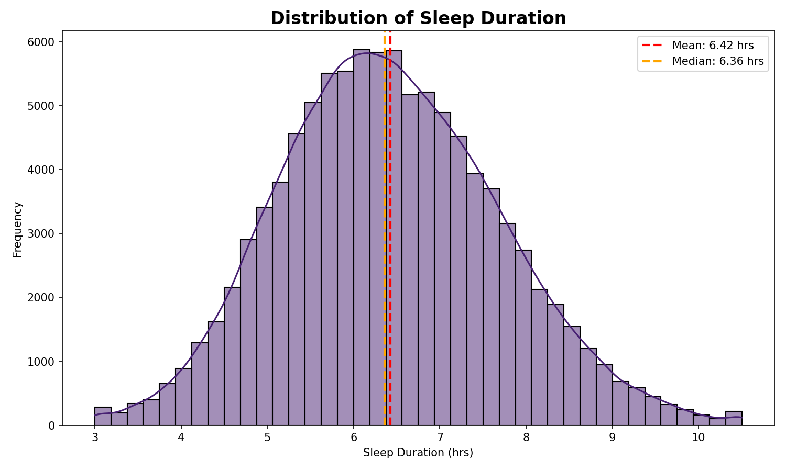

### Sleep Quality Distribution
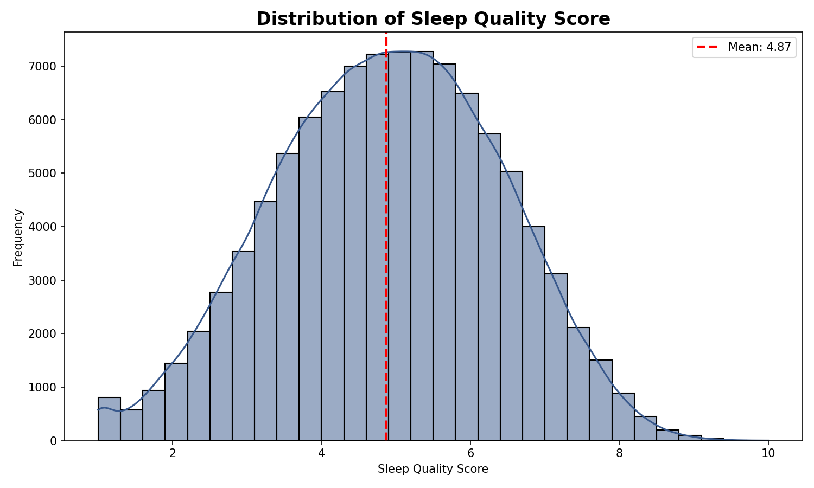

### Sleep Duration vs Quality (colored by Stress)
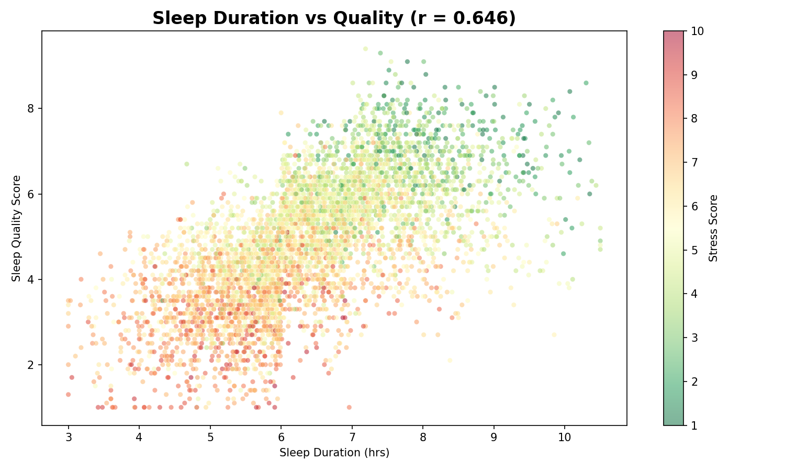

### Sleep Disorder Risk Distribution
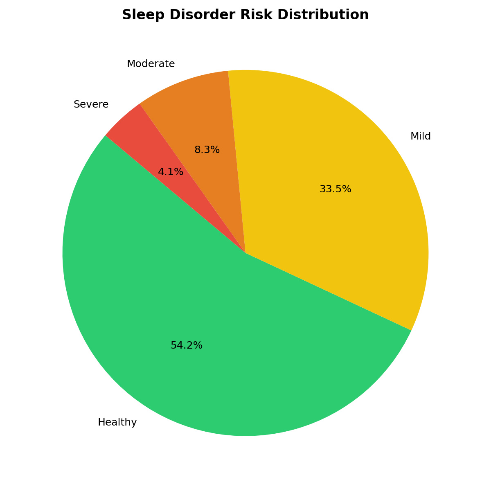

### Average Sleep Duration by Occupation
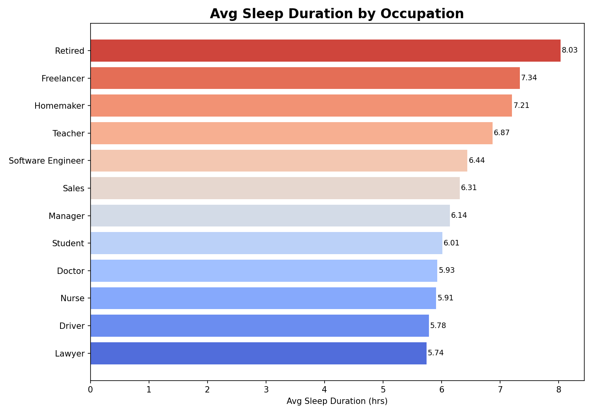

### Stress Score vs Sleep Quality
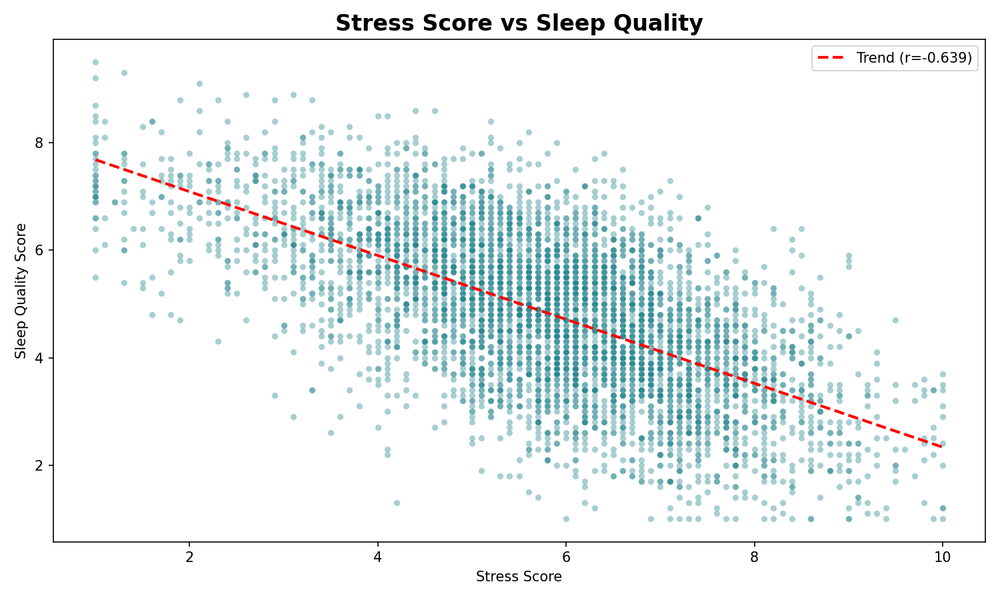

### Caffeine Impact on Sleep Quality
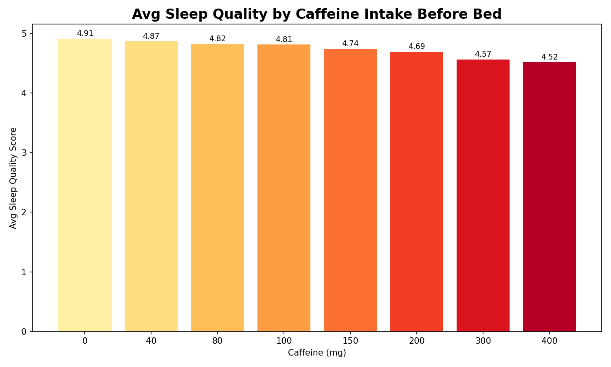

### Mental Health Impact on Sleep & Cognition
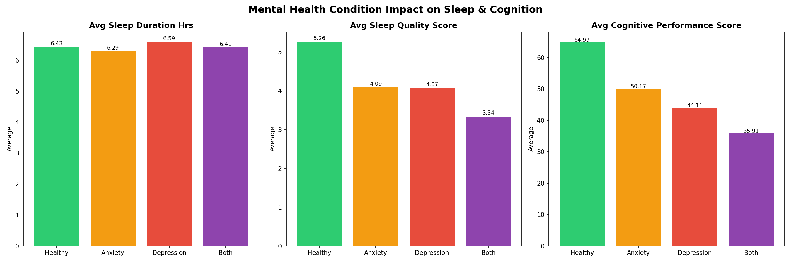

### Correlation Heatmap
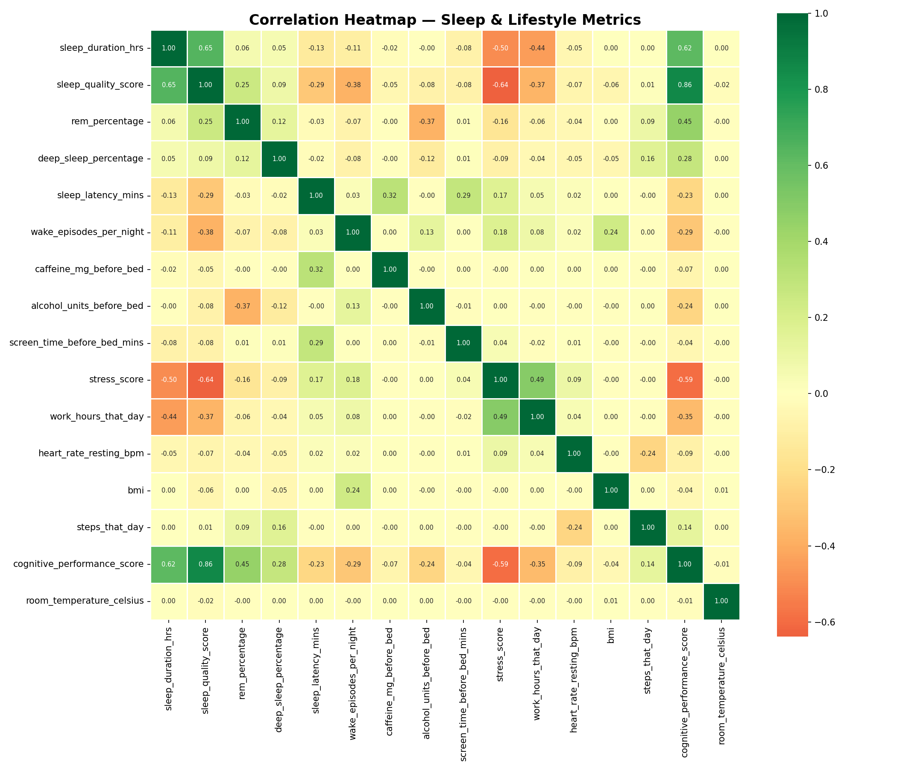

### Chronotype Analysis
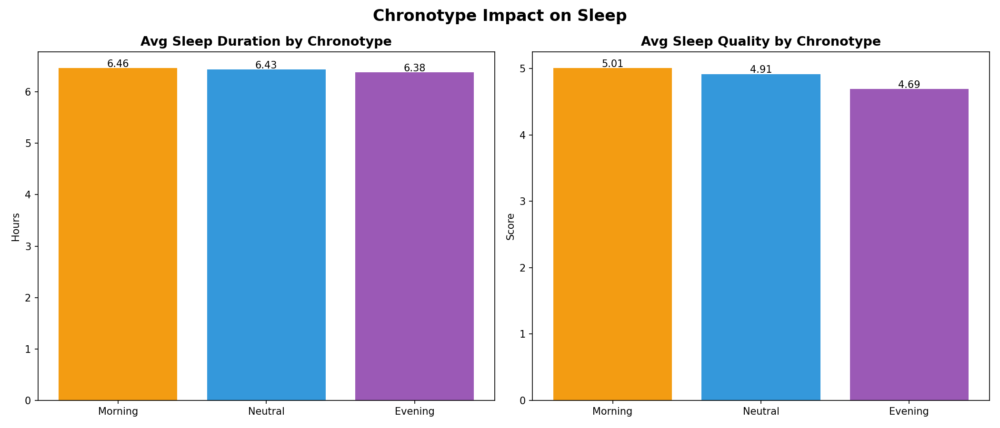

### Screen Time vs Sleep Quality
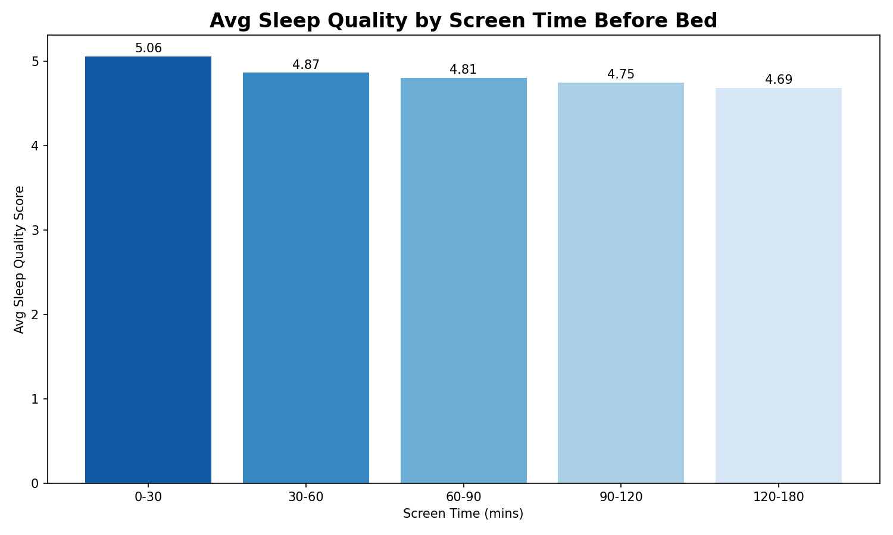

### Seasonal & Day Type Effects
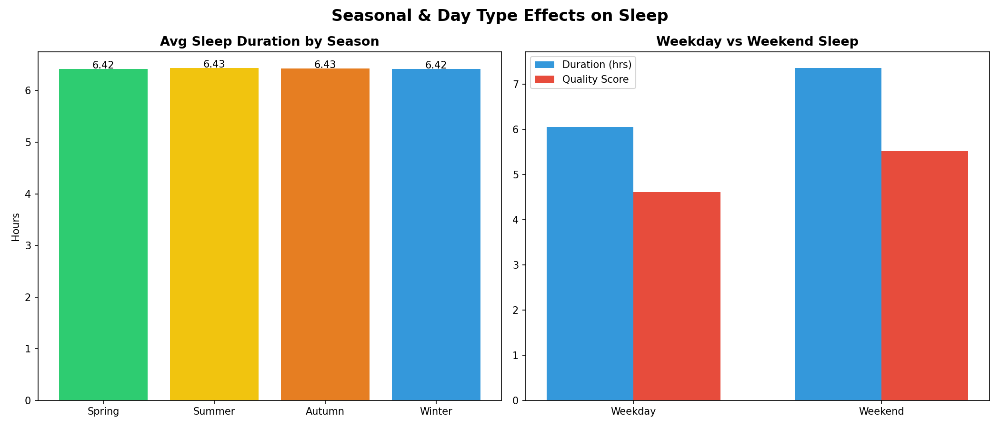

### Sleep Disorder Risk by Age Group
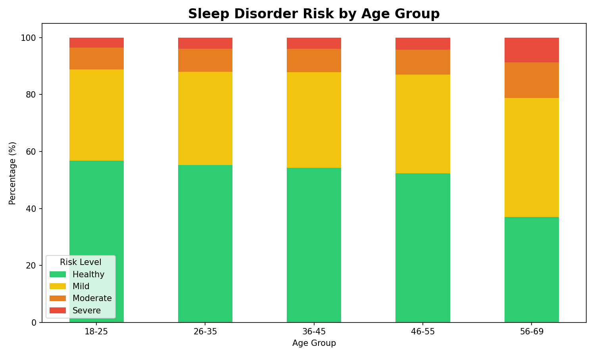

### Exercise & Sleep Aid Impact
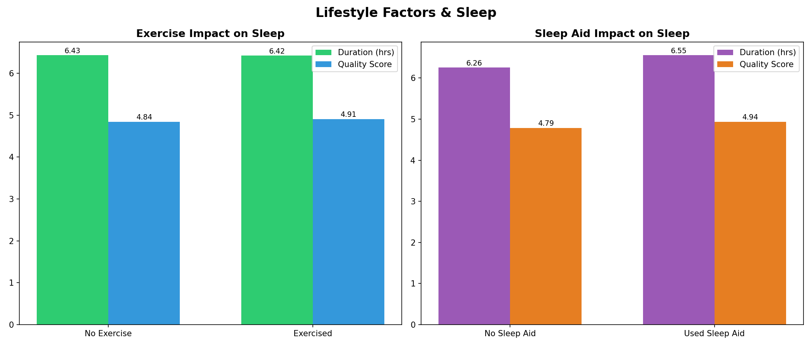

### Sleep Quality vs Cognitive Performance
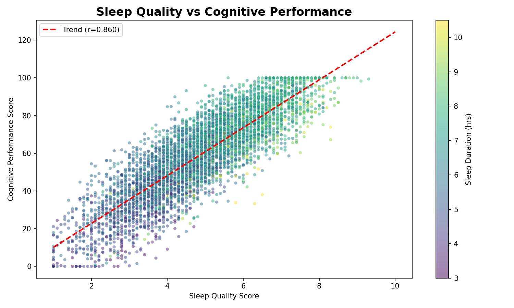

### Sleep Quality by Country
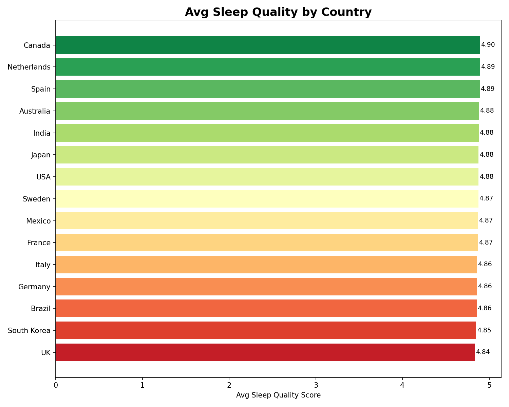

### Dashboard
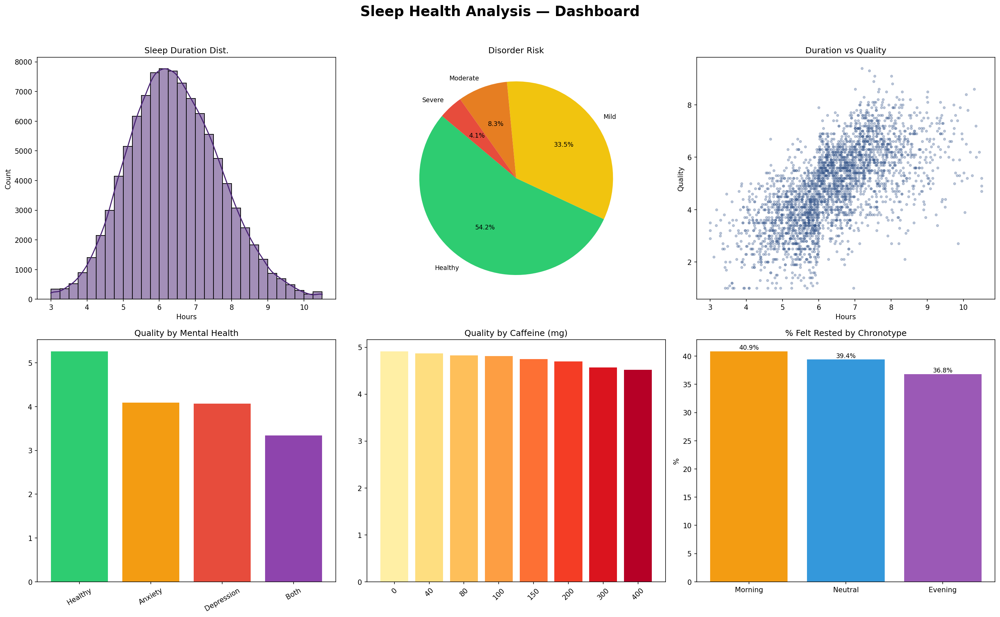

## Project Structure

```
sleep-health-analysis/
├── data/
│   └── sleep_health_dataset.csv
├── images/
│   ├── 01_sleep_duration_distribution.png
│   ├── 02_sleep_quality_distribution.png
│   ├── 03_duration_vs_quality.png
│   ├── 04_disorder_risk_pie.png
│   ├── 05_sleep_by_occupation.png
│   ├── 06_stress_vs_quality.png
│   ├── 07_caffeine_vs_quality.png
│   ├── 08_mental_health_impact.png
│   ├── 09_correlation_heatmap.png
│   ├── 10_chronotype_analysis.png
│   ├── 11_screen_time_vs_quality.png
│   ├── 12_season_daytype.png
│   ├── 13_disorder_risk_by_age.png
│   ├── 14_exercise_sleepaid.png
│   ├── 15_quality_vs_cognitive.png
│   ├── 16_country_sleep_quality.png
│   └── 17_dashboard.png
├── notebooks/
│   └── sleep_health_analysis.ipynb
├── sql/
│   └── sleep_health_analysis.sql
├── LICENSE
└── README.md
```

## Tools & Technologies

- **Python** — pandas, numpy, matplotlib, seaborn
- **Jupyter Notebook** — Interactive analysis
- **SQL** — 17 structured queries for database analysis
- **Dataset** — 100K records, 32 features (sleep, lifestyle, health, demographics)

## License

This project is licensed under the MIT License — see the [LICENSE](LICENSE) file for details.
